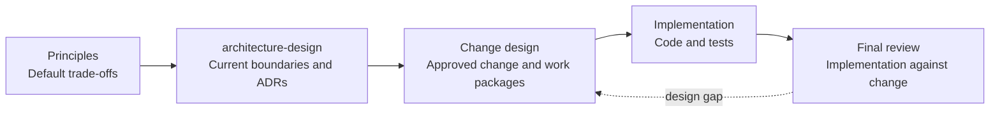

# TedToolkit Skills

An [Agent Skills](https://agentskills.io) marketplace for reusable TedToolkit .NET development workflows. Install only the plugin that matches the work you need; this repository is a plugin source, not an application.

## Quick start

Register a local checkout as a Codex marketplace, then install a plugin:

```powershell
codex plugin marketplace add ./path/to/skills
codex plugin add tedtoolkit-shared@tedtoolkit-skills
```

After installing or updating a plugin, start a new task so Codex loads its current skills. Claude Code compatibility metadata remains available in [`.claude-plugin/marketplace.json`](.claude-plugin/marketplace.json); Codex uses [`.codex-plugin/marketplace.json`](.codex-plugin/marketplace.json) and each plugin's Codex manifest.

## Plugins

| Plugin | Use it for |
| --- | --- |
| [`tedtoolkit-shared`](plugins/tedtoolkit-shared/) | .NET diagnosis, Release build/test recovery, TUnit tests, atomic gitmoji commits, and safely merging the remote default branch. |
| [`tedtoolkit-annotations`](plugins/tedtoolkit-annotations/) | C# XML comments and explicit contracts using TedToolkit annotations for boxing, constness, documentation, maintenance, and ownership. |
| [`tedtoolkit-roslynhelper`](plugins/tedtoolkit-roslynhelper/) | Generating C# source with `TedToolkit.RoslynHelper`. |
| [`tedtoolkit-project-development`](plugins/tedtoolkit-project-development/) | Change design, design-principle governance, ADRs, TDD implementation, design reviews, project scaffolding, and README writing. |

`tedtoolkit-project-development` replaces the former `tedtoolkit-project-scaffolding` plugin. Install the new plugin name if you previously used the old one.

Skills are matched from natural-language intent, and can also be invoked explicitly. They follow a gate-first workflow: inspect first, present a plan or draft, wait for explicit approval, then make changes or commits.

## Project-development workflow

`tedtoolkit-project-development` uses a one-way refinement flow: each layer makes the previous
layer concrete without reinterpreting it.



`docs/principles/` is the highest-level source of default trade-offs. Architecture design must
follow it, recording current boundaries in `docs/architecture/` and durable choices or approved
exceptions in `docs/adr/`. Change design must follow both `docs/principles/` and
`docs/architecture/`, making their applicable constraints explicit in `docs/changes/`. Implementation
uses the approved change index and selected work package as its sole design contract.

The source request and external hard constraints enter the change design as product inputs; they do
not override principles silently. Every change and work package records a range-based person-month
estimate, assumptions, confidence, and exclusions. The change total separately includes work-package
effort, coordination, verification, migration or rollout, and contingency.

## Development

Repository conventions, plugin layout, and authoring rules are maintained in [CLAUDE.md](CLAUDE.md). [AGENTS.md](AGENTS.md) deliberately points to that single source of truth.

### Prerequisites

- Python 3.13+ with `pyyaml`
- Codex CLI
- Git and Bash (Git for Windows is supported)
- .NET 10 SDK for Release-build evaluation scenarios

### Run evaluations

```powershell
py -3.13 tests/run_evals.py
py -3.13 tests/run_evals.py generate-commit-message
py -3.13 tests/run_evals.py --filter conflict
```

The bespoke harness runs real, sequential Codex invocations in temporary fixtures. Runs incur API cost and normally take 30 seconds to 3 minutes per scenario. See [tests/README.md](tests/README.md) for setup, assertions, and available options.
