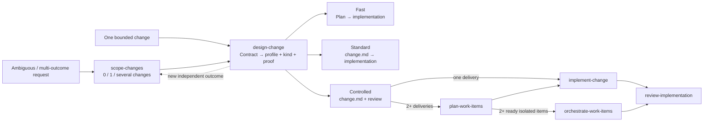

# TedToolkit Skills

An [Agent Skills](https://agentskills.io) marketplace for reusable TedToolkit workflows. Install only the plugin that matches the work you need; this repository is a plugin source, not an application.

## Quick start

Register a local checkout as a Codex marketplace, then install a plugin:

```powershell
codex plugin marketplace add ./path/to/skills
codex plugin add tedtoolkit-shared@tedtoolkit-skills
```

After installing or updating a plugin, start a new task so Codex loads its current skills. Claude Code compatibility metadata remains available in [`.claude-plugin/marketplace.json`](.claude-plugin/marketplace.json); Codex uses [`.codex-plugin/marketplace.json`](.codex-plugin/marketplace.json) and each plugin's Codex manifest.

## Plugins

| Plugin | Use it for |
| --- | --- |
| [`tedtoolkit-shared`](plugins/tedtoolkit-shared/) | .NET diagnosis, Release build/test recovery, TUnit tests, atomic gitmoji commits, and safely merging the remote default branch. |
| [`tedtoolkit-annotations`](plugins/tedtoolkit-annotations/) | C# XML comments and explicit contracts using TedToolkit annotations for boxing, constness, documentation, maintenance, and ownership. |
| [`tedtoolkit-roslynhelper`](plugins/tedtoolkit-roslynhelper/) | Generating C# source with `TedToolkit.RoslynHelper`. |
| [`tedtoolkit-project-development`](plugins/tedtoolkit-project-development/) | Request scoping, risk-scaled change design and implementation, optional work-item orchestration, design-principle governance, ADRs, professional review, project scaffolding, and README writing. |
| [`tedtoolkit-resume`](plugins/tedtoolkit-resume/) | Factual resume generation, revision and review, job-description matching, and structured interview-question design. |

`tedtoolkit-project-development` replaces the former `tedtoolkit-project-scaffolding` plugin. Install the new plugin name if you previously used the old one.
`tunit-testing` is the canonical TUnit skill; the former explicit name `tunit-unit-testing` remains
as a deprecated compatibility alias for one migration release.
`design-change` and `implement-change` are the canonical change skills; explicit invocations of
`change-design` and `implement-change-tdd` remain temporary compatibility aliases.

Skills are matched from natural-language intent, and can also be invoked explicitly. They follow a gate-first workflow: inspect first, present a plan or draft, wait for explicit approval, then make changes or commits.

## Project-development workflow

Use `scope-changes` only when a request is ambiguous or may contain several independently valuable
outcomes. Already bounded work goes directly to its owning skill. Each change enters
`design-change`, which clarifies its contract and chooses the lightest safe profile; the user does
not classify the work. Fast avoids a workflow document, Standard uses one concise human handoff,
and Controlled adds review and creates work items only for two or more necessary deliveries.
Parallel execution remains a separate opt-in runtime choice.



Agent scheduling stays flat. The delivery owner retains user dialogue, integration authority, and
status; `review-implementation` owns the aggregate review conclusion. For material Controlled or
shared-boundary risk, at least one fresh read-only reviewer covers code and test judgments against an
exact candidate; split reviewers or verification executors only when expertise, context, permissions,
or environment justify it. Bounded low-risk work uses one synchronous compact review over the current
workspace snapshot without requiring a commit or digest.
`work-items.md` is the single mutable delivery-status source.

Change and work-item records are concise current-truth handoffs for human developers. Approved
multi-change preparation lives under tracked `.tedtoolkit/preparations/`; optional local
orchestration state lives under ignored `.tedtoolkit/runs/`. Process logs, leases, and receipts do
not belong in human records. Tests are
selected by proof purpose and execution shape; test source defines how behavior can be proved,
revision-bound or immediate compact verification records what actually ran, and review traceability connects the two.
Small repositories normally keep one coherent test project and split only for real environment,
lifecycle, cadence, isolation, or ownership boundaries.

## Documentation ownership and lifecycle

| Document | Owns | Completion handling |
| --- | --- | --- |
| `.tedtoolkit/preparations/` | One source request's tracked temporary evidence index, partition, and active lanes | Delete after all resulting changes no longer need coordination and no tracked workflow record references it; retain only when explicit repository policy requires it. |
| `docs/changes/` | One delivery's behavior contract and work items | Delete a completed or superseded record after it is present on the default branch, durable extraction is complete or not needed, and no tracked workflow record references it; retain only when explicit repository policy requires it. |
| `docs/adr/` | Enduring, material decision rationale and trade-offs | Retain; supersede with a new ADR when the decision changes. |
| `docs/architecture/` | Current system boundaries and cross-cutting semantics | Update when the current system changes. |
| `docs/principles/` | Default rules for recurring design trade-offs | Maintain as durable guidance. |

`review-implementation` reports documentation disposition after durable decisions are captured in
ADRs, current semantics are captured in architecture records, and active migration or operational
procedures are retained elsewhere. `continue-change` performs exact eligibility checks and deletes
one terminal change only after an explicit cleanup request or explicit continuation of that already
terminal record. Git history is the archive; do not create a completed-change documentation tree.
Ignored `.tedtoolkit/runs/` and `.tedtoolkit/worktrees/` follow their defined successful-completion
cleanup lifecycle.

## Development

Repository conventions, plugin layout, and authoring rules are maintained in [CLAUDE.md](CLAUDE.md). [AGENTS.md](AGENTS.md) deliberately points to that single source of truth.

### Prerequisites

- Python 3.10+ with `pyyaml`
- Codex CLI
- Git and Bash (Git for Windows is supported)
- .NET 10 SDK for Release-build evaluation scenarios

### Run evaluations

```powershell
py -3.10 tests/run_evals.py
py -3.10 tests/run_evals.py generate-commit-message
py -3.10 tests/run_evals.py --filter conflict
py -3.10 tests/run_evals.py --plugin tedtoolkit-project-development design-change
py -3.10 tests/run_evals.py --plugin tedtoolkit-project-development workflow-scripts
```

The harness groups evals by plugin and runs them sequentially in temporary fixtures. Skill scenarios
make real Codex calls and normally take 30 seconds to 3 minutes; static workflow-script scenarios
make no API call. See [tests/README.md](tests/README.md) for plugin selection, assertions, judging,
and available options.
